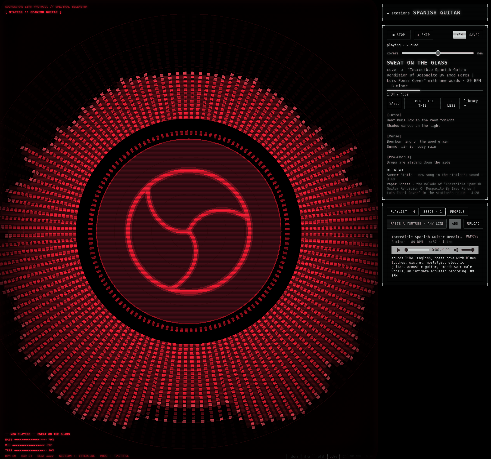

# soundscape-native-linux

**A Linux-native Vulkan client for [Soundscape](https://github.com/Sparaa/soundscape)** — the self-hosted AI radio.
It talks to the Soundscape api directly (stations, play/skip/save, seeds, saved-song playlist), plays the songs with
a gapless crossfade through PipeWire/PulseAudio/ALSA, analyses the mix itself, and renders the red-phosphor **pulse**
visualizer with raw Vulkan (GLSL → SPIR-V, no three.js, no browser). Dear ImGui draws the side panel and the HUD.



The web UI is not needed while this runs; both can be open at once (they share the api's radio state).

## What you need

- Linux with a **Vulkan 1.1+ GPU driver** (NVIDIA 470+, Mesa RADV/ANVIL, …). Check: `vulkaninfo --summary`.
- A running Soundscape api: `docker compose --profile gpu --profile llm up -d` in the [soundscape-monorepo](https://github.com/Sparaa/soundscape-monorepo)
  (or the standalone repo). Default api URL is `http://127.0.0.1:3021`.
- Build tools (Ubuntu 24.04 names):

```bash
sudo apt-get install -y build-essential cmake git glslc libvulkan-dev libglfw3-dev nlohmann-json3-dev \
                        libcurl4-openssl-dev libasound2-dev vulkan-tools
# optional, for --validation:
sudo apt-get install -y vulkan-validationlayers
```

Dear ImGui (v1.92.9) and miniaudio (0.11.25) are fetched by CMake at configure time; everything else comes from apt.

## Build and run

```bash
git clone https://github.com/Sparaa/soundscape-native-linux && cd soundscape-native-linux
cmake -S . -B build -DCMAKE_BUILD_TYPE=Release
cmake --build build -j
ctest --test-dir build --output-on-failure     # unit tests: analysis, beat clock, ABC parser
./build/soundscape-native                        # or: --api http://host:3021  --station <id>  --fullscreen
```

Options: `--api URL` (or `SOUNDSCAPE_API=…`), `--station ID`, `--fullscreen`, `--no-vsync`, `--validation`.

Keys: **Space** play/stop · **N** skip · **S** save · **F**/**F11** fullscreen (panel hidden) · **Tab** panel ·
**H** HUD · **C** CRT post pass · **Ctrl+Q** quit.

## What it does

| Panel | |
|---|---|
| Stations | list, create, open; sidecar health line (yue2 / sheetsage / clipgrab · GPU · idle/loaded) |
| Radio | STOP/SKIP, NEW ↔ SAVED (radio vs saved-song playlist), `covers ↔ new` slider, now playing + plan + progress + lyrics, SAVE / MORE LIKE THIS / LESS, UP NEXT (click to play now), rendering progress |
| Station | PLAYLIST (saved songs, click to play), SEEDS (add a YouTube/any link, remove), PROFILE (sound, mood/genre tags, blurb) |
| Settings | volume, CRT, HUD, glow, fullscreen, api URL |

The player is a port of the web app's `RadioPlayer`: two decks, a 3 s equal-time crossfade starting `duration − 3 s`,
a 250 ms tick, a 15 s stuck watchdog, and a next-song fetch that always clears (a failed fetch retries after 1 s
instead of stalling until Skip). The visualizer inputs are the ones the web publishes as the
[visual feed contract](https://github.com/Sparaa/soundscape/blob/main/docs/visual-feed.md): band energies from an
AnalyserNode-equivalent FFT (Blackman window, 0.8 smoothing, −100…−30 dB), a 64-bin log spectrum, a beat clock
phase-locked to bass onsets, section cues parsed from the song's ABC score, and a palette from the tags.

Design notes: [`docs/design.md`](docs/design.md).

## Status

v0.1 — first cut. Ported: the `pulse` scene with its CRT post pass, the radio/playlist player, stations/seeds/profile.
Not yet: the `radial` / `nebula` / `rings` scenes, seed **upload** from a local file (links work), library view,
playlist export. See `docs/design.md` → "Not ported yet".

## License

Apache-2.0, like Soundscape. Dear ImGui (MIT) and miniaudio (MIT-0 / public domain) are fetched at build time.
